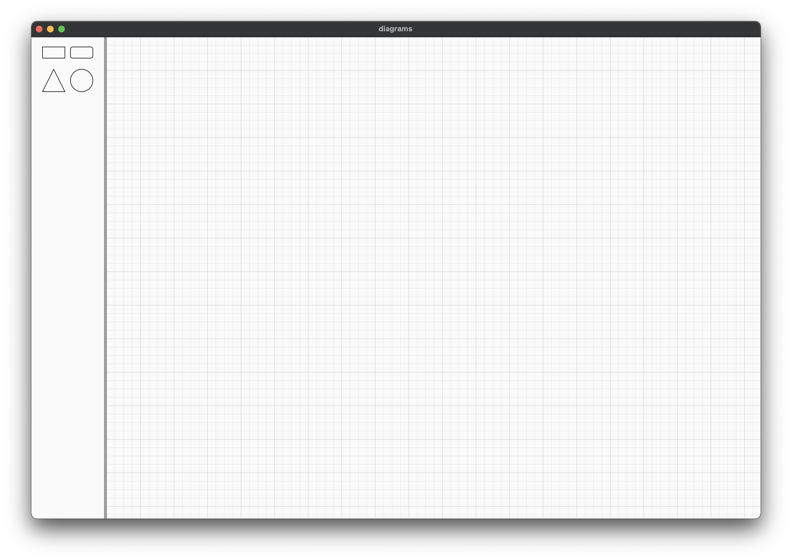
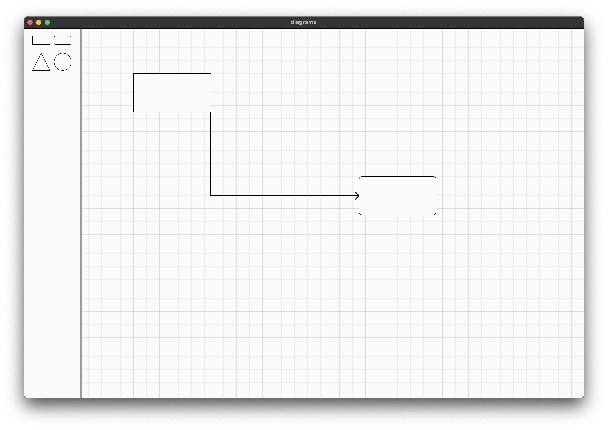
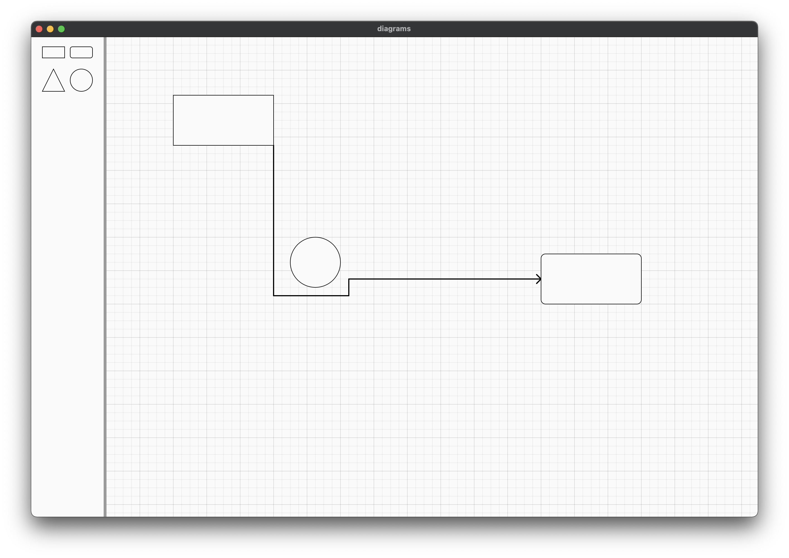

# diagrams

This is a test project to play around with CustomPainter and an excuse to test Flutter Web and Flutter Desktop.

The main idea is to basically rewrite [draw.io](draw.io) as close as possible.
In this way I can explore and learn new stuff.

### goals

[x] have a set of basic shapes  
[x] draw arrows to link shapes  
&nbsp;&nbsp;&nbsp;&nbsp;&nbsp;(after many iteration I tryed to adapt [this](https://github.com/RafaelBarbosatec/a_star) A* algorithm to my needs)  
[] change arrow path
[] many, many, more

### examples

This first image is the empty grid when app starts:  

When you add elements you can link them with arrows, the A* alghorithm takes care of finding the shortest path:  

When you add elements that cross arrows, the A* alghorithm takes care of finding the shortest path avoiding collision with element not linked to the arrow:  
