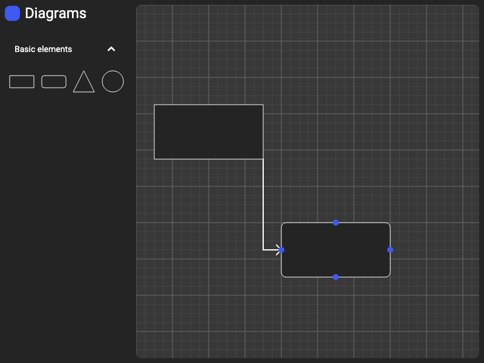

# Diagrams

This is a test project to play around with CustomPainter and an excuse to test Flutter Web and Flutter Desktop.

The main idea is to basically rewrite [draw.io](draw.io) as close as possible.
In this way I can explore and learn new stuff.

### Goals

- [x] Have a set of basic shapes  
- [x] Draw arrows to link shapes
  (after many iteration I tryed to adapt [this](https://github.com/RafaelBarbosatec/a_star) A* algorithm to my needs)  
- [ ] Change arrow path  
- [ ] Change elements dimensions  
- [ ] Textfields inside elements  
- [ ] Change elements properties (color, border, background)  
- [ ] Change text properties  
- [ ] Many, many, more

### Examples

This first image is the empty grid when app starts:  

When you add elements you can link them with arrows, the A* algorithm takes care of finding the shortest path:  

When you add elements that cross arrows, the A* algorithm takes care of finding the shortest path avoiding collision with element not linked to the arrow:  

### Tests

To manually run test use:

To run bloc tests `flutter test test/bloc_test.dart`  
To run unit tests `flutter test test/unit_test.dart`  
To run golden tests `flutter test test/golden_test.dart --tags=golden`  
To update golden tests `flutter test test/golden_test.dart --update-goldens --tags=golden`

Inside `.githooks` folder there are a pre-commit script that performs formatter and analyzer and a pre-push script that runs tests and the coverage command.

If you are on vscode, in order to get the test coverage, you need to install [flutter coverage](https://marketplace.visualstudio.com/items?itemName=Flutterando.flutter-coverage) and [coverage-gutters](https://marketplace.visualstudio.com/items?itemName=ryanluker.vscode-coverage-gutters).

There is also a `flutter_test.yml` intended to be used inside github actions that will perform tests on pull requests.

<!-- ### Contributors

 -->